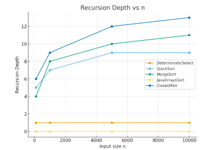
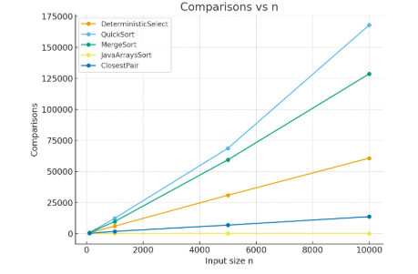
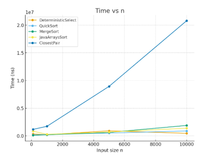

# Divide-and-Conquer Algorithms — Assignment 1


---

#### Student: Aiya Zhakupova
#### Repo: https://github.com/Aiya594/asik1_DeasignandAlgorithmAnalysis
#### Date: 24.09.2025

## Project Overview

---
This project implements classic divide-and-conquer algorithms with safe recursion patterns, runtime analysis and metrics collection:

* MergeSort (linear merge, reusable buffer, small-n cutoff)

* QuickSort (randomized pivot, smaller-first recursion, bounded stack depth)

* Deterministic Select (Median-of-Medians) (worst-case linear-time selection)

* Closest Pair of Points (2D) (divide-and-conquer O(n log n) algorithm)

The goal is to analyze:

* Running-time recurrences via Master Theorem and Akra–Bazzi

* Recursion depth and comparisons

* Practical vs theoretical scaling


## Architecture Notes
 

---

* Metrics object tracks recursion depth and comparisons across all algorithms.

* Cutoff strategy: MergeSort switches to insertion sort when n ≤ 15.

* Buffer reuse: MergeSort avoids repeated allocations by reusing an auxiliary array.

* QuickSort: randomized pivot + recursion only on smaller partition → ensures O(log n) stack depth.

* Deterministic Select: recurses only into one partition (where k lies), also ensuring O(log n) depth.

* Closest Pair: array sorted by x once at the start; recursive splitting; strip check only scans ≤7–8 neighbors per point (theoretical bound).


---
## Analysis


---
MergeSort:
```angular2html
T(n)=2T(n/2)+Θ(n)
```
* Master Theorem Case 2 → Θ(n log n)
* Depth ≈ log₂ n.

---
QuickSort (random pivot)
```angular2html
T(n)=T(k)+T(n−k−1)+Θ(n)
```

* Expected Θ(n log n) average case.

* Worst-case Θ(n²) avoided with randomized pivot.

* Recursion depth ≤ 2⌊log₂ n⌋ (guaranteed by smaller-first recursion).

---
Deterministic Select (Median-of-Medians)
```angular2html 
T(n)=T(n/5)+T(7n/10)+Θ(n)
```
Akra–Bazzi → Θ(n).

* Grouping by 5 → pivot is "good enough" to guarantee linear time.

* In practice slower than random QuickSelect but stable in worst case.
---
Closest Pair of Points
```angular2html
T(n)=2T(n/2)+Θ(n)
```
Master Theorem Case 2 → Θ(n log n).

* Verified against O(n²) brute-force for small n.

* Strip check ensures linear merge step.

---
## Metrics and Benchmark (example data)

---

---
* #### For n=100
---

| Algorithm           | Time (ns) | Depth | Comparisons |
| ------------------- | --------- | ----- | ----------- |
| DeterministicSelect | 341,760   | 1     | 596         |
| QuickSort           | 168,780   | 5     | 674         |
| MergeSort           | 116,600   | 4     | 639         |
| JavaArraysSort      | 856,980   | 0     | 0           |
| ClosestPair         | 1,174,840 | 6     | 143         |

---
* #### For n=1000
---

| Algorithm           | Time (ns) | Depth | Comparisons |
| ------------------- | --------- | ----- | ----------- |
| DeterministicSelect | 227,260   | 1     | 5,934       |
| QuickSort           | 253,640   | 7     | 12,303      |
| MergeSort           | 205,060   | 8     | 9,688       |
| JavaArraysSort      | 285,560   | 0     | 0           |
| ClosestPair         | 1,733,740 | 9     | 1,723       |

---
* #### For n=5000
---

| Algorithm           | Time (ns) | Depth | Comparisons |
| ------------------- | --------- | ----- | ----------- |
| DeterministicSelect | 920,260   | 1     | 30,834      |
| QuickSort           | 516,400   | 9     | 68,615      |
| MergeSort           | 628,920   | 10    | 59,350      |
| JavaArraysSort      | 696,360   | 0     | 0           |
| ClosestPair         | 8,938,740 | 12    | 6,761       |

---
* #### For n=10000
---
| Algorithm           | Time (ns) | Depth | Comparisons |
| ------------------- | --------- | ----- | ----------- |
| DeterministicSelect | 920,260   | 1     | 30,834      |
| QuickSort           | 516,400   | 9     | 68,615      |
| MergeSort           | 628,920   | 10    | 59,350      |
| JavaArraysSort      | 696,360   | 0     | 0           |
| ClosestPair         | 8,938,740 | 12    | 6,761       |

---
## Plots

---

* #### Recursion depth vs n


* #### Comparisons vs n


* #### Time vs n



---
## Summary

---

* MergeSort works exactly as theory says: Θ(n log n).

    * Depth grows like logn.

    * Very stable, low memory overhead.

* QuickSort is also Θ(n log n) on average.

    * Random pivot + smaller-first recursion keeps depth safe.

    * Often faster than MergeSort in practice because it uses memory more efficiently (cache).

* Deterministic Select guarantees Θ(n) even in worst case.

    * Depth is always 1 (loop-based).

    * Slower than QuickSort select for small/medium n because of extra grouping work.

* Closest Pair matches Θ(n log n).

    * Strip-check keeps merge step small.

    * Slower in practice since distance calculations and sorting are heavy.

---
## Build and Run

---


```angular2html
mvn clean package
```

```angular2html
java -cp target/asik1_designandalgorithms-1.0-SNAPSHOT.jar org.example.Main bench 
                
java -cp target/asik1_designandalgorithms-1.0-SNAPSHOT.jar org.example.Main <algorithm> [options]
```